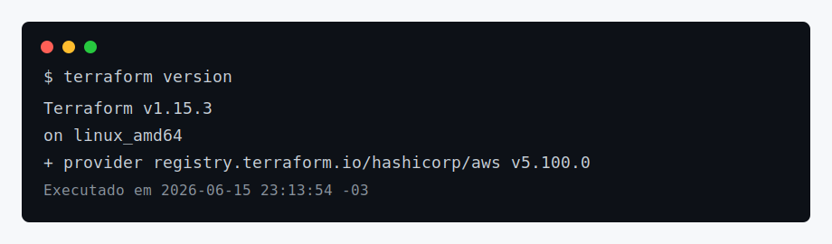
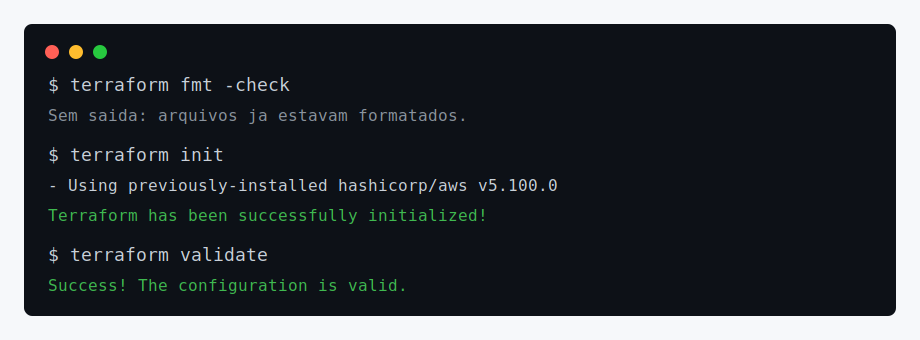
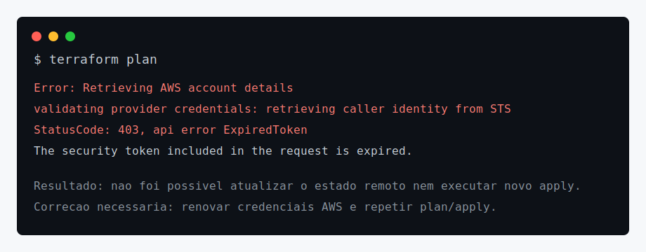
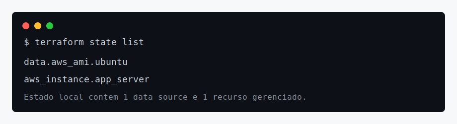
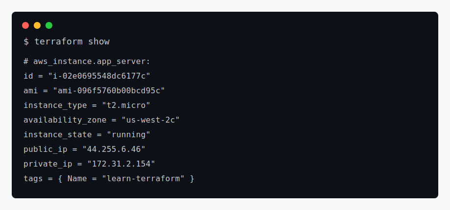

# Terraform AWS Get Started

Projeto IaC baseado no tutorial oficial [Create infrastructure](https://developer.hashicorp.com/terraform/tutorials/aws-get-started/aws-create), da HashiCorp. O objetivo é provisionar uma instância EC2 na AWS usando Terraform.

## Arquivos do projeto

- `terraform.tf`: define a versão mínima do Terraform e o provider `hashicorp/aws`.
- `main.tf`: configura o provider AWS, consulta a AMI Ubuntu mais recente e declara a EC2 `aws_instance.app_server`.
- `.terraform.lock.hcl`: trava a versão do provider usada no workspace.

## Configuração criada

```hcl
provider "aws" {
  region = "us-west-2"
}

resource "aws_instance" "app_server" {
  ami           = data.aws_ami.ubuntu.id
  instance_type = "t2.micro"

  tags = {
    Name = "learn-terraform"
  }
}
```

## Passo a passo executado

### 1. Verificação da versão

Propósito: confirmar que o Terraform CLI está instalado e que o provider AWS está disponível no workspace.



### 2. Formatação, inicialização e validação

Propósito: padronizar os arquivos `.tf`, inicializar o diretório e validar a sintaxe/configuração.



Comandos executados:

```bash
terraform fmt -check
terraform init
terraform validate
```

### 3. Planejamento da infraestrutura

Propósito: consultar a AWS, atualizar o estado e calcular as mudanças antes do apply.



Resultado obtido nesta execução: o `terraform plan` foi bloqueado porque as credenciais AWS configuradas estavam expiradas (`ExpiredToken`). Por isso, não foi possível executar um novo `terraform apply` nesta sessão.

## Itens provisionados registrados no Terraform

O diretório já possuía `terraform.tfstate` com recursos registrados. A listagem abaixo evidencia o que está sob gerenciamento do Terraform no estado local.



### Recursos

| Item | Tipo | Nome Terraform | Finalidade |
| --- | --- | --- | --- |
| AMI Ubuntu | `data.aws_ami` | `data.aws_ami.ubuntu` | Buscar dinamicamente a AMI Ubuntu Noble 24.04 mais recente em `us-west-2`. |
| Instância EC2 | `aws_instance` | `aws_instance.app_server` | Servidor virtual `t2.micro` criado para o laboratório. |

Evidência extraída do `terraform show`:



Resumo do recurso no estado local:

- ID: `i-02e0695548dc6177c`
- Região/AZ: `us-west-2c`
- AMI: `ami-096f5760b00bcd95c`
- Tipo: `t2.micro`
- Estado registrado: `running`
- Tag: `Name = learn-terraform`

## Observações

- A HashiCorp recomenda destruir os recursos após o laboratório para evitar custos.
- O state local não deve ser versionado em repositórios públicos; por isso `.terraform/`, `*.tfstate` e arquivos de variáveis sensíveis estão no `.gitignore`.
- Para concluir uma nova aplicação do tutorial, renove as credenciais AWS e execute:

```bash
terraform plan
terraform apply
terraform state list
terraform show
```
